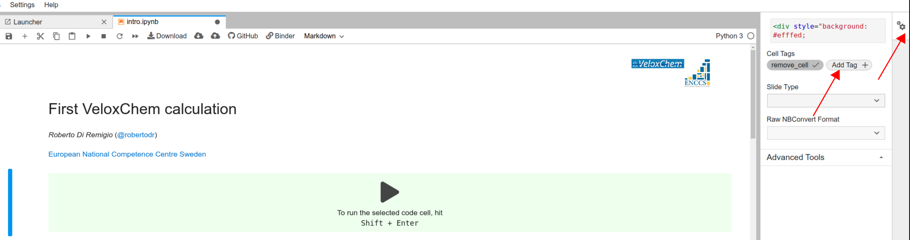

Instructor's guide
==================

Editing the material
^^^^^^^^^^^^^^^^^^^^

This website uses `sphinx-lesson <https://coderefinery.github.io/sphinx-lesson/>`_. Pages can be added in a variety of formats:

- Jupyter notebooks (``.ipynb``), like all the pages for Day 1.
- reStructuredText (``.rst``), as usual for Sphinx-based documentation pages.
- Markdown (``.md``), like all the pages for Day 2.

However, note that we **do not** use plain Markdown, but the `MyST
<https://myst-parser.readthedocs.io/en/latest/>`_ parser (short for  *Markedly
Structured Text*) that allows for richer content. For example, it is possible to
embed Jupyter notebook input and/or output cells *via* `MyST-nb
<https://myst-nb.readthedocs.io/en/latest/index.html>`_ or even write *entire*
notebooks in plain-text!

Here are some quick guides to ``.rst`` and ``.md`` formats:

- For ``MyST`` https://myst-parser.readthedocs.io/en/latest/using/syntax.html
- For reStructuredText https://docutils.sourceforge.io/docs/user/rst/quickref.html
- For ``MyST-nb`` https://myst-nb.readthedocs.io/en/latest/use/markdown.html

Useful notes on Jupyter notebooks
~~~~~~~~~~~~~~~~~~~~~~~~~~~~~~~~~

Sometimes it's necessary to hide and/or remove content from a notebook when
using it as training material. This can be accomplished with *tags*.

In JupyterLab
-------------

In this example, we want to remove the cell entirely when rendering it as a webpage.




In Jupyter notebooks
--------------------

In this example, we want to remove the cell entirely when rendering it as a webpage.

.. figure:: img/tags-notebook.png
   :scale: 50%
   :alt: Setting tags in with the notebook interface.
   :align: center


In ``MyST-nb``
--------------

In this example, we only want to show the *output* of executing the cell.

.. code-block:: md

   ```{code-block} ipython3
   :tags: [remove-input]

   import py3Dmol as p3d

   v = p3d.view(width=400, height=400)

   with open("inputs/porphyrin.xyz", "r") as fh:
       porphyrin_xyz = fh.read()

   v.addModel(porphyrin_xyz, "xyz")
   v.setStyle({'stick':{}})
   v.zoomTo()
   v.show()
   ```


Learning outcomes
^^^^^^^^^^^^^^^^^

- Familiarize with VeloxChem.
- Show efficient usage on Dardel.
- Give enough information to adapt to HPC clusters similar to Dardel, in particular LUMI-C.

First iteration
^^^^^^^^^^^^^^^

This workshop is an offshoot of the earlier `VeloxChem: quantum chemistry from
laptop to HPC <https://enccs.github.io/veloxchem-workshop>`_. In the future, we
might decide to merge the two into one single lesson, taught in more that 2
half days.

**Day 1 - Thursday 3 March 2022**

- Day 1 is a mix of lectures and interactive work.
- The introductions is longer than usual because it includes a 10-minute
  overview on the VeloxChem project.
- Episode 2 :ref:`modern-hpc-architectures` also gives details about
  Dardel's architecture.
- Episode 3 is mostly a lecture. It's delivered as a notebook with interactive
  plots that attendees can play with live.
- The two "scaling study" episodes are done in breakout rooms after a short
  introduction in the main room.

.. csv-table::
   :widths: auto
   :align: center
   :delim: ;

    9:00 -  9:20 ; Welcome and introduction to the training course 
    9:20 -  9:40 ; :doc:`notebooks/first-steps`
    9:40 -  9:45 ; Break 
    9:45 - 10:15 ; :ref:`modern-hpc-architectures`
   10:15 - 10:25 ; Break
   10:25 - 10:55 ; :ref:`performance-theory`
   10:55 - 11:05 ; Break
   11:05 - 11:35 ; :ref:`scf-scaling-study`
   11:35 - 11:45 ; Break
   11:45 - 12:15 ; :ref:`eri-overview`
   12:15 - 12:30 ; Wrap-up

**Day 2 - Friday 4 March 2022**

- All episodes are done in breakout rooms after a short introduction in the
  main room.

.. csv-table::
   :widths: auto
   :align: center
   :delim: ;


    9:00 -  9:10 ; What did we cover yesterday?
    9:10 -  9:40 ; :ref:`linrsp-scaling-study`
    9:40 -  9:50 ; Break
    9:50 - 10:30 ; :ref:`x-ray-cpp`
   10:30 - 10:40 ; Break
   10:40 - 11:20 ; :ref:`exciton`
   11:20 - 11:30 ; Break
   11:30 - 12:10 ; :ref:`ntos`
   12:10 - 12:15 ; Break
   12:15 - 12:30 ; Wrap-up
