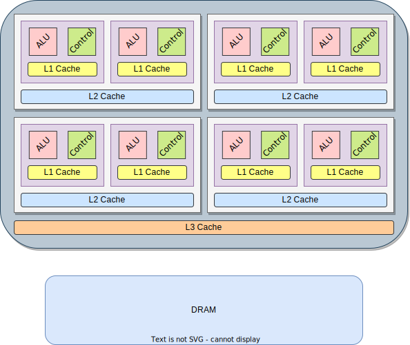

.. _modern-hpc-architectures:

==========================
 Modern HPC architectures
==========================

.. objectives::

   - Understand how modern HPC hardware is built and why.
   - Learn about the memory hierarchy on Dardel and LUMI.

Quantum chemistry has evolved hand-in-hand with advances in computer
hardware: each new computing architecture that becomes available allows leaps
both in the size of molecular systems that can be studied and the methods that
can be applied.

All hardware available today, from your phone to any large-scale data center, is
engineered to be parallel. Multiple cores, multiple threads, multiple vector
lanes are all, to lesser or greater extent, **built-in** the hardware we have at
our disposal.
The evolution of the hardware has brought a paradigm shift in software
development. It is *mandatory* for developers to explicitly think about
parallelism and how to harness it to improve performance. Most importantly,
applications need to be *scalable* in order to exploit all hardware resources
available today, but also in the future, as more parallel resources are packed
into chips.

Moore's law [*]_
================

Back in 1965, Gordon Moore observed that the number of transistors in a dense
integrated circuit doubles about every two years. This observation has been since dubbed **Moore's law**.
Being able to pack more transistors means smaller size of a single element, such
that higher clock rates can be achieved.
Higher clock rates mean higher instruction throughput and thus higher
performance.

If we look at the historical trends in the past 50 years of microprocessor
development, we indeed notice the doubling in transistor numbers asserted in
Moore's law. It is also quite clear that in the early 2000s the corresponding
increase in clock rates stalled: modern chips have clock rates in the 3 GHz
range.  Code will not be more performant on newer architectures without
*significant* programmer intervention.

.. chart:: charts/microprocessor-trend-data.json

   The evolution of microprocessors. The number of transistors per chip
   increases every 2 years or so. However, it can no longer be exploited by the
   core frequency due to power consumption limits. Before 2000, the increase in
   the single core clock frequency was the major source of performance increase.
   Mid-2000 mark a transition towards multi-core processors. [*]_

What happened? Processor designs hit three walls:

- **Power consumption wall**. This scales as the third power of the clock rate and
  the heat generated by a denser transistor packing cannot be dissipated
  effectively by air cooling alone. Higher clock rates would result in
  power-inefficient computation.
- **Memory wall**. While clock rates for computing chips have seen a
  steady rise in the past decades, the same has not been the case for memory,
  especially that residing *off-chip*. Read/write operations in memory that is
  far away in time and space from the computing chips is expensive, both in
  terms of time and required power. Algorithms bound by memory performance will
  not gain from faster computation.
- **Instruction-level parallelism wall**. Automatic parallelization at the
  instruction level, though superscalar instructions, pipelining, prefetching,
  and branch prediction, leads to more complicated chip designs and only affords
  *constant*, not *scalable*, factors of speedup.

To compensate, chip designs to achieve performance have increased the number of
physical cores on the same die.  More cores, more threads, and wider vector
instruction sets all contribute to expose more *hardware parallelism* for
applications to take advantage of.

The memory hierarchy
====================

A modern CPU consists of multiple cores on the same chip die. Each core has its
own **arithmetic logic unit** (ALU) and **control unit**.

   A schematic view of a modern multicore CPU. Each purple-shaded box is a
   single core, with its own **arithmetic logic unit** (ALU), **control unit**,
   and **L1 cache** (yellow-shaded box).  Groups of cores *might* share the **L2
   cache** (blue-shaded box), which is larger and slower than L1. Groups of
   cores in the chip share the **L3 cache** (orange-shaded box), in turn larger
   and slower than L2. The CPU has access to off-chip **dynamic random access
   memory** (DRAM), which is usually of the order of hundreds of gigabytes.
   Access to DRAM is much slower than access to caches due to lower memory clock
   rates and locality.

As mentioned, clock rates for memory have not seen the same rise as for
computing chips. This has direct impact on performance: a read/write operation
can require multiple clock cycles, during which the cores might be idle.
This is called **latency** and its impact depends on the *locality* of the
memory being accessed.
Modern CPUs have a **memory hierarchy**:

- **Registers** are very small and very fast units of memory that store the data
  about to be processed by the core.
- multiple caches, with each level the latency typically increases by an order
  of magnitude:

  - **L1 cache** is per-core memory where both instructions and data to be
    processed are stored for fast retrieval into the registers. Its size is in the
    order of *tens of kilobytes* per core.
  - **L2 cache**. Its size is in the order of *hundreds of kilobytes*
    per core and it might be shared by groups of cores.
  - **L3 cache**. It is shared among cores, either subgroups or all, and its size
    is in the order of *tens of megabytes* per *group* of cores.

- **DRAM** this is the main off-chip memory. Nowadays, HPC clusters have *hundreds
  of gigabytes* of RAM per node. Its latency is usually two order of magnitude
  larger than that of L3 cache.

We can see that the closest the memory is to the core, the faster it can be
accessed. Unfortunately, on-chip memory is rather small.

As an example, the `AMD EPYC 7742
<https://en.wikichip.org/wiki/amd/epyc/7742>`_ CPUs on Dardel have 64 cores and
cache hierarchy:

- L1 instruction cache of 32 KiB per core, for a total of 2 MiB.
- L1 data cache of 32 KiB per core, for a total of 2 MiB.
- L2 cache of 512 KiB per core, for a total of 32 MiB.
- L3 cache of 16 MiB shared among 16 cores, for a total of 256 MiB.

Multiprocessor systems and non-uniform memory access
====================================================

Multiple multicore CPUs can be packaged together in a **socket**. The CPUs communicate through fast
point-to-point channels.
Access to the memory is however not equal across CPUs in the socket. In this
architecture, each CPU in the socket is attached to its own off-chip memory.

Off-chip memory accesses become **non-uniform**: the CPU on socket 0
(socket 1) experience higher latency and, possibly, reduced bandwidth
accessing DRAM attached to the CPU on socket 1 (socket 0).
To further complicate matters, *cores* on each socket might also be arranged in
**non-uniform memory access** (NUMA) domains. Cores within each socket might
experience different latency and bandwidth when accessing memory.

.. figure:: img/numa.svg
   :align: center
   :scale: 80%

   Schematic view of a typical dual-socket node on a modern cluster.  Each
   socket houses two CPUs, each with 64 cores. The cores are arranged in a
   configuration with 4 NUMA domains per socket (NPS4).  Each NUMA domain has 16
   cores.

The Dardel system at PDC
========================

Dardel is the new high-performance cluster at PDC: it has a CPU *partition* and
a GPU *partition* is planned.

   Dardel is a *cluster*, consisting of multiple *cabinets* (also known as
   racks). Each cabinet houses multiple *blades*, interconnected on a high-speed
   network. Multiple *nodes* reside on a single blade and each of them is
   *dual-socket*: it houses **two** AMD EPYC 7742 CPUs, each with 64 cores
   clocking at 2.25GHz. Each core can sustain 2 threads. [*]_

.. typealong:: Exploring the memory hierarchy on Dardel

   Each of Dardel's node is dual-socket: the memory latency and bandwidth will
   differ based on which CPU/core accesses the off-chip memory.
   We will use the `numactl <https://linux.die.net/man/8/numactl>`_ command-line
   tool to get a description of the NUMA domains on the Dardel login and compute
   nodes.

   To do so:

   - Log in to the machine:

     .. code-block:: shell

        ssh <your-username>@dardel.pdc.kth.se

   - Run the command:

     .. code-block:: shell

        numactl -H

   On the log in node, this should output the following:

   .. code-block:: text

      available: 2 nodes (0-1)
      node 0 cpus: 0 1 2 3 4 5 6 7 8 9 10 11 12 13 14 15 16 17 18 19 20 21 22 23 24 25 26 27 28 29 30 31 32 33 34 35 36 37 38 39 40 41 42 43 44 45 46 47 48 49 50 51 52 53 54 55 56 57 58 59 60 61 62 63 128 129 130 131 132 133 134 135 136 137 138 139 140 141 142 143 144 145 146 147 148 149 150 151 152 153 154 155 156 157 158 159 160 161 162 163 164 165 166 167 168 169 170 171 172 173 174 175 176 177 178 179 180 181 182 183 184 185 186 187 188 189 190 191
      node 0 size: 257342 MB
      node 0 free: 70756 MB
      node 1 cpus: 64 65 66 67 68 69 70 71 72 73 74 75 76 77 78 79 80 81 82 83 84 85 86 87 88 89 90 91 92 93 94 95 96 97 98 99 100 101 102 103 104 105 106 107 108 109 110 111 112 113 114 115 116 117 118 119 120 121 122 123 124 125 126 127 192 193 194 195 196 197 198 199 200 201 202 203 204 205 206 207 208 209 210 211 212 213 214 215 216 217 218 219 220 221 222 223 224 225 226 227 228 229 230 231 232 233 234 235 236 237 238 239 240 241 242 243 244 245 246 247 248 249 250 251 252 253 254 255
      node 1 size: 258019 MB
      node 1 free: 49565 MB
      node distances:
      node   0   1
        0:  10  32
        1:  32  10

   This tells us:

   #. There are 2 NUMA domains: ``available: 2 nodes (0-1)``
   #. The index for the threads in the domain 0, together with the total and
      free amounts of memory.

      .. code-block:: text

         node 0 cpus: 0 1 2 3 4 5 6 7 8 9 10 11 12 13 14 15 16 17 18 19 20 21 22 23 24 25 26 27 28 29 30 31 32 33 34 35 36 37 38 39 40 41 42 43 44 45 46 47 48 49 50 51 52 53 54 55 56 57 58 59 60 61 62 63 128 129 130 131 132 133 134 135 136 137 138 139 140 141 142 143 144 145 146 147 148 149 150 151 152 153 154 155 156 157 158 159 160 161 162 163 164 165 166 167 168 169 170 171 172 173 174 175 176 177 178 179 180 181 182 183 184 185 186 187 188 189 190 191
         node 0 size: 257342 MB
         node 0 free: 70756 MB

   #. The index for the threads in the domain 1, together with the total and
      free amounts of memory.

      .. code-block:: text

         node 1 cpus: 64 65 66 67 68 69 70 71 72 73 74 75 76 77 78 79 80 81 82 83 84 85 86 87 88 89 90 91 92 93 94 95 96 97 98 99 100 101 102 103 104 105 106 107 108 109 110 111 112 113 114 115 116 117 118 119 120 121 122 123 124 125 126 127 192 193 194 195 196 197 198 199 200 201 202 203 204 205 206 207 208 209 210 211 212 213 214 215 216 217 218 219 220 221 222 223 224 225 226 227 228 229 230 231 232 233 234 235 236 237 238 239 240 241 242 243 244 245 246 247 248 249 250 251 252 253 254 255
         node 1 size: 258019 MB
         node 1 free: 49565 MB

   #. The distances between nodes. These numbers give a measure of the latency
      incurred accessing memory on one NUMA domain from the other. Intra-domain
      accesses are not free, but have ~3 times lower latency that inter-domain
      ones.

      .. code-block:: text

         node distances:
         node   0   1
           0:  10  32
           1:  32  10

   Let's see what the situation on a compute node is:

   - Request a very short interactive allocation on a node:

     .. code-block:: shell

        salloc -N 1 --ntasks-per-node 1 -t 00:05:00 -A edu22.veloxchem -p main

   - Log in into the node you have been allocated:

     .. code-block:: shell

        ssh ...

   - Run the command:

     .. code-block:: shell

        numactl -H

   How does the NUMA set up differ on the compute nodes?

.. keypoints::

   - It is not possible to achieve higher clock rates: more performing hardware
     packs multiple computational cores on the same die.
   - Multicore machines give us access to more parallelism, but this needs to be
     harnessed with careful software design.
   - Understanding the existing memory hierarchy is essential for efficient use
     of the hardware.

.. [*] This section is adapted, with permission, from the training material for
        the `ENCCS CUDA workshop
        <https://enccs.github.io/CUDA/1.01_GPUIntroduction/#exposing-parallelism>`_.
.. [*] The data in this plot is collected by Karl Rupp and made available `on GitHub <https://github.com/karlrupp/microprocessor-trend-data>`_.
.. [*] Adapted from the `PDC documentation website <https://www.pdc.kth.se/support/documents/basics/introduction.html>`_.
