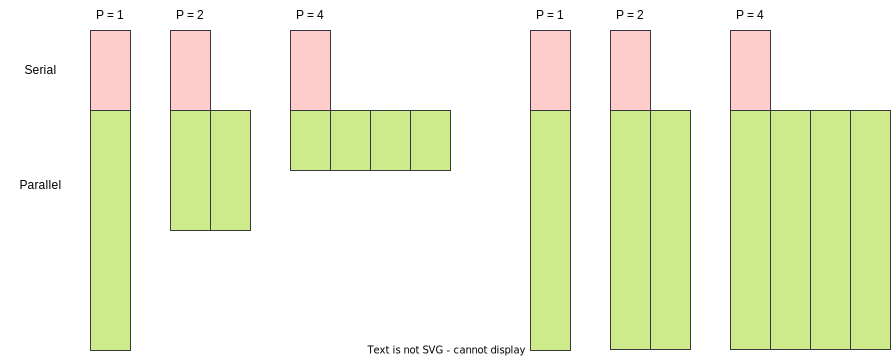

.. _performance-theory:

Performance theory
==================

.. objectives::

   - Understand the different meanings of performance.
   - Familiarize with theoretical models of performance analysis.

Quantum chemical programs must be written in an explicitly parallel fashion in
order to harness the computational power offered by the increasing number of
cores that can be packed on modern chips.
The effort expended in parallelizing or improving parallelization of a program
needs to be measured against suitable metrics to be justified. The term
"performance" has many meanings in this context.
A code has improved performance compared to another, if it:

- Shows lower **latency**, *i.e.* it computes a single result in less time.
- Shows higher **throughput**, *i.e.* it computes a bunch of results at a higher
  rate.
- Consumes less power.

In quantum chemistry we are mostly interested in reducing the **total time to
solution**, *i.e.* the latency of a computation.
It is thus quite natural to evaluate parallel performance in terms of the *speedup* and *efficiency* metrics:

Speedup
  The ratio of serial and parallel times to solution.

  .. math::

     \mathrm{speedup} = \frac{T_{1}}{T_{P}}

Efficiency
  The speedup per unit of parallel worker.

  .. math::

     \mathrm{efficiency} = \frac{\mathrm{speedup}}{P} = \frac{T_{1}}{PT_{P}}

The serial time to solution :math:`T_{1}` might be that of the *serialized*
parallel program, that is the parallel algorithm running with :math:`P=1`
workers. Speedup and efficiency are then said to be *relative*.
These metrics are said to be *absolute* if :math:`T_{1}` is measured using a
serial algorithm that does not parallelize well.

Observed speedups are usually *sublinear*: running on :math:`P` workers is a
factor of :math:`< P` faster. Ideally, one would want to observe *linear*
speedups, but this is very hard to achieve in practice, due, for example, to the
overhead incurred in distributing computation among workers.
In rare cases, *superlinear* speedup might be observed, usually due to favorable
combinations of cache-friendliness and efficient use of vectorization.

Scalability
-----------

*Scalability* is the ability of hardware and software to deliver increased
performance as a function of the resources used.

There are two metrics to consider:

Strong scalability
  The ability of an algorithm to obtain speedup for a **fixed problem size** and
  an **increasing number of workers**.

Weak scalability
  The ability of an algorithm to obtain speedup for an **increasing problem
  size** and an **increasing number of workers**.

Let's take a closer look at the measured latencies :math:`T_{1}` and
:math:`T_{P}`.  Both are the sum of the fractions executed in serial or in
parallel. While for :math:`T_{1}` it holds:

.. math::

   T_{1} = W_{\mathrm{ser}} + W_{\mathrm{par}}

while for :math:`T_{P}`:

.. math::

   T_{P} \geq W_{\mathrm{ser}} + \frac{W_{\mathrm{par}}}{P}

the equality being valid for a "perfectly" parallelization.

.. _amdahl:

Amdahl's law
~~~~~~~~~~~~

Let's assume that there is a *constant* fraction :math:`f` of :math:`T_{1}` that is serial, then:

.. math::

   \begin{align}
   W_{\mathrm{ser}} &= fT_{1} \\
   W_{\mathrm{par}} &= (1-f)T_{1}
   \end{align}

This gives an upper bound on the achievable speedup and efficiency as a function
of the serial fraction:

.. math::

   \mathrm{speedup} \leq \frac{1}{f + (1-f)P}

also known as **Amdahl's law** :cite:`Amdahl1967-cv`.

.. chart:: charts/amdahl-speedup.json

   Strong scaling, in terms of achievable **speedup**, as a function of the number of
   workers, according to Amdahl's law.  We consider different values of the
   serial fraction :math:`f`.

.. chart:: charts/amdahl-efficiency.json

   Strong scaling, in terms of achievable **efficiency**, as a function of the
   number of workers, according to Amdahl's law.  We consider different values
   of the serial fraction :math:`f`.

Quite pessimistically, in the limit of an infinite number of workers, strong
scalability is essentially bound by the serial fraction:

.. math::

   \mathrm{speedup}_{\infty} \leq \frac{1}{f}

.. _gustafson:

Gustafson's law
~~~~~~~~~~~~~~~

20 years after Amdahl published his paper on strong scalability, Gustafson noted
an important fact: more capable hardware is usually applied to larger problems,
leading to observed speedups exceeding what would be predicted by Amdahl's law.
:cite:`Gustafson1988-ch`

How is this possible? We must make two assumptions:

#. That the serial part of our algorithm remains constant when the problem size
   increases.
#. That the parallel part grows *linearly* with the number of workers.

   In a strong scalability regime, the amount of work remains constant, while
   the capability of the machine to perform parallel work increase.
   Asymptotically, the speedup is dominated by the fraction of work executed
   serially, as observed by Amdahl.
   However, increasing the amount of work proportionally to the parallel
   capabilities, will eventually let the serial portion become insignificant to
   the total time to solution.

When exploring weak scalability, the **scaled speedup** is our figure of merit:

.. math::

   \text{scaled speedup} = P + (1-P)f

This metric grows *linearly* with the number of workers.

.. keypoints::

   - Time to solution is the performance metric most often used in quantum
     chemistry.
   - Strong calability of an application depends on the fraction of serial work
     performed.
   - In practice, more capable hardware is employed on larger problems: we might
     be able to observe weak scalability even without removing serial
     bottlenecks.
